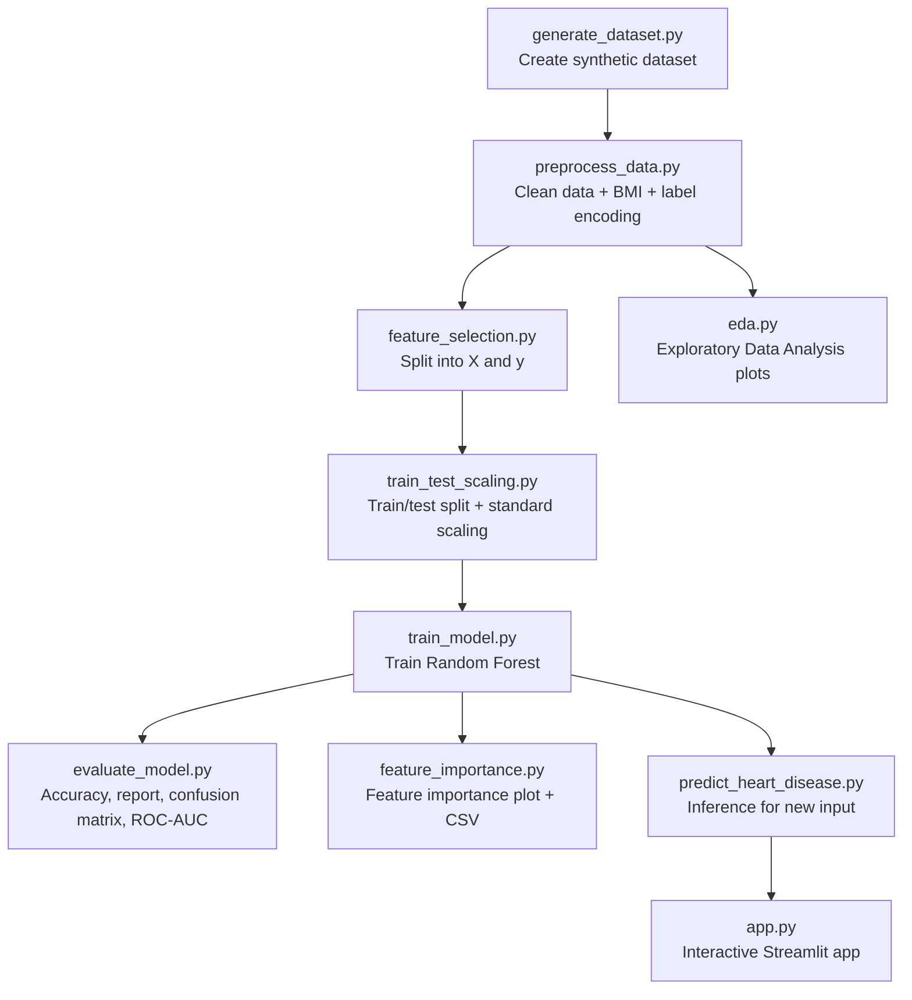

# Heart Disease Prediction Mini Project

This project predicts heart disease risk using a Random Forest model and provides a Streamlit web app for interactive risk estimation.

It is designed as a complete mini-project pipeline for presentation, covering:
- synthetic data generation
- preprocessing and feature engineering
- train/test split and scaling
- model training
- evaluation and visualization
- feature importance analysis
- prediction for new user input
- deployment through a Streamlit interface

---

## 1. Project Objective

Build an end-to-end machine learning system that can:
1. Learn from patient lifestyle and health features
2. Predict whether a person is at risk of heart disease
3. Explain model performance with metrics and plots
4. Provide an easy-to-use UI for risk checking

---

## 2. Workflow Overview (Presentation Flow)



---

## 3. Tech Stack

- Python
- Pandas, NumPy
- Scikit-learn
- Matplotlib, Seaborn
- Joblib
- Streamlit

Install dependencies:

```bash
pip install -r requirements.txt
```

---

## 4. Folder Structure

```text
heart disease/
├── app.py
├── generate_dataset.py
├── preprocess_data.py
├── feature_selection.py
├── train_test_scaling.py
├── train_model.py
├── evaluate_model.py
├── feature_importance.py
├── predict_heart_disease.py
├── eda.py
├── data/
├── models/
└── outputs/
```

---

## 5. Step-by-Step Workflow Explanation

### Step 0: Environment Check
Script: `heart_disease_rf_setup.py`

Purpose:
- confirms required libraries can be imported

Presentation note:
- use this as your "project setup completed" checkpoint.

### Step 1: Generate Dataset
Script: `generate_dataset.py`

Input:
- no external input required

What it does:
- generates 1000 synthetic patient records
- creates realistic risk relationships (age, cholesterol, glucose, blood sugar, smoking, activity)
- creates target column `heart_disease` using a risk score + noise

Output:
- `data/heart_disease_synthetic.csv`

### Step 2: Preprocess Data
Script: `preprocess_data.py`

Input:
- `data/heart_disease_synthetic.csv`

What it does:
- handles missing values (median for numeric, mode for categorical)
- creates BMI feature from height and weight
- label-encodes categorical columns
- saves encoders for inference consistency

Output:
- `data/heart_disease_processed.csv`
- `models/label_encoders.joblib`

### Step 3: Feature/Target Split
Script: `feature_selection.py`

Input:
- `data/heart_disease_processed.csv`

What it does:
- separates features (X) and target (y)

Output:
- `data/X_features.csv`
- `data/y_target.csv`

### Step 4: Train/Test Split + Scaling
Script: `train_test_scaling.py`

Input:
- `data/heart_disease_processed.csv`

What it does:
- performs stratified train/test split (80/20)
- applies StandardScaler to numerical columns (`age`, `height`, `weight`, `BMI`)
- keeps feature order consistent

Output:
- `data/X_train.csv`, `data/X_test.csv`
- `data/y_train.csv`, `data/y_test.csv`
- `models/standard_scaler.joblib`

### Step 5: Train Model
Script: `train_model.py`

Input:
- `data/X_train.csv`
- `data/y_train.csv`

What it does:
- trains `RandomForestClassifier(n_estimators=100, random_state=42)`

Output:
- `models/random_forest_model.joblib`

### Step 6: Evaluate Model
Script: `evaluate_model.py`

Input:
- `models/random_forest_model.joblib`
- `data/X_test.csv`
- `data/y_test.csv`

What it does:
- calculates accuracy
- generates classification report
- builds confusion matrix heatmap
- plots ROC curve and computes AUC

Output:
- `outputs/evaluation/classification_report.txt`
- `outputs/evaluation/classification_report.csv`
- `outputs/evaluation/confusion_matrix_heatmap.png`
- `outputs/evaluation/roc_auc_curve.png`

### Step 7: Feature Importance
Script: `feature_importance.py`

Input:
- `models/random_forest_model.joblib`
- `data/X_train.csv`

What it does:
- extracts and sorts Random Forest feature importances
- visualizes ranking in horizontal bar chart

Output:
- `outputs/feature_importance/feature_importance_sorted.csv`
- `outputs/feature_importance/feature_importance_horizontal.png`

### Step 8: Exploratory Data Analysis (EDA)
Script: `eda.py`

Input:
- `data/heart_disease_processed.csv`
- optional: `models/label_encoders.joblib` for decoding labels

What it does:
- class distribution chart
- feature correlation heatmap
- age distribution
- BMI distribution
- cholesterol and glucose distribution

Output:
- plots saved in `outputs/eda/`

### Step 9: Prediction for New User
Script: `predict_heart_disease.py`

Input:
- new patient data dictionary

What it does:
- canonicalizes user values (e.g., yes/no, low/medium/high)
- computes BMI
- applies saved label encoders and scaler
- enforces training feature order
- returns class prediction + probability
- exports a step10 model file for demo (`random_forest_model_step10.joblib`)

Output:
- prediction dictionary
- `models/random_forest_model_step10.joblib`

### Step 10: Streamlit App Deployment
Script: `app.py`

Main app capabilities:
1. Login-protected UI
2. Risk Calculator page:
	- user enters health profile
	- model predicts heart disease probability
	- blood pressure category is combined with ML probability for an integrated risk level
3. Train Model page:
	- upload CSV
	- choose target/test split/number of trees
	- train model interactively
	- view classification report and confusion matrix
	- download trained model

---

## 6. Run Order (Important)

Run these scripts in this exact order for the full pipeline:

```bash
python heart_disease_rf_setup.py
python generate_dataset.py
python preprocess_data.py
python feature_selection.py
python train_test_scaling.py
python train_model.py
python evaluate_model.py
python feature_importance.py
python eda.py
python predict_heart_disease.py
```

Run the app:

```bash
python -m streamlit run app.py
```

---

## 7. Files to Show During Presentation

Recommended demo artifacts:
1. `data/heart_disease_synthetic.csv` (generated dataset)
2. `data/heart_disease_processed.csv` (after preprocessing)
3. `models/random_forest_model.joblib` (trained model)
4. `outputs/evaluation/confusion_matrix_heatmap.png`
5. `outputs/evaluation/roc_auc_curve.png`
6. `outputs/feature_importance/feature_importance_sorted.csv`
7. Streamlit app pages (Risk Calculator + Train Model)

---

## 8. Mini Project Summary (One-Slide Version)

- We created a complete heart disease prediction pipeline.
- We cleaned and transformed data, engineered BMI, and encoded categorical fields.
- We trained a Random Forest classifier and evaluated it using standard classification metrics.
- We explained model behavior using feature importance and visual analytics.
- We deployed an interactive Streamlit app for both training and risk prediction.

---

## 9. Note

This is an educational mini project for learning and demonstration purposes, not a clinical diagnostic system.
